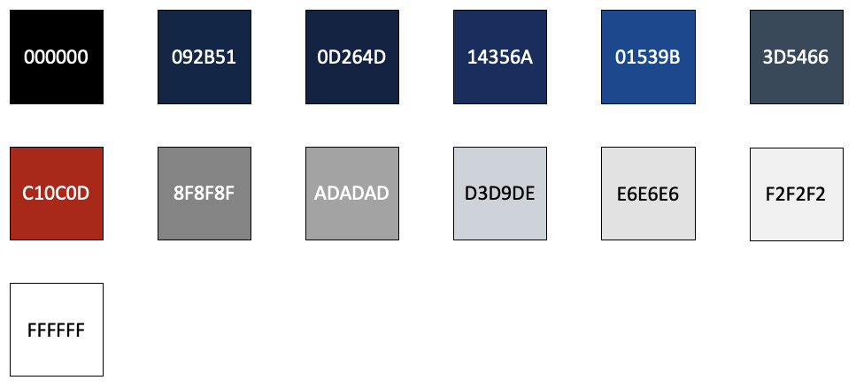

# Color Codes

The below color codes are the primary colors used within Connections. For components where those colors are not sufficient, refer to our [HCL Design System – Colors](internal-link-redacted).



```
// Black 
#000000

// Blue1000
#092B51

// Blue950
#0D264D

// Blue850
#14356A

// Blue800
#01539B

// CoolGrey700
#3D5466

// Red800
#C10C0D

// NeutralGrey500
#8F8F8F

// NeutralGrey400
#ADADAD

// CoolGrey200
#D3D9DE

// NeutralGrey150
#E6E6E6

// NeutralGrey100
#F2F2F2

// White
#FFFFFF
```
