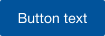
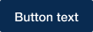
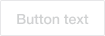

# Buttons

Buttons in the Connections 8 UI are changing from Connections 7 in that their design becomes more pointed to the role they are fulfilling.

We are now differentiating between primary and secondary actions. [Primary](#primary-buttons) actions are 'call to action' type of actions, which means they are the important and most frequently used action(s) on a page to achieve a certain task. This can be something like 'Save', 'Create Topic', 'Edit' etc.

Secondary actions are any other actions that should be available to the user but which are more or less optional or negative actions, e.g. 'Cancel', 'Close', 'Delete' etc. Secondary actions leverage different button designs depending on whether they are displayed within normal content / view (as [Outlined Buttons](#outlined-buttons)) or a [Modal](../modal) / popup dialog (as [Text buttons](#text-buttons)).

There is an additional state for [disabled](#disabled-buttons) actions, i.e. actions that are generally available but are not applicable for the current context or user.

## Contained Buttons

Contained buttons are always displayed as a typical button, filled in with contrasting text. On hover, the button color changes to a darker hue (pressing state) and a box shadow.

| Contained button | Contained button on hover | Disabled contained button |
|--------------------|---------------|---------------|
|  |  | 

## Outlined Buttons

Outlined buttons are used in normal content or views and have a border in the color of the normal buttons but no fill color. The text color is the same as the button as well. The change in color and box shadow on hover apply to them as well.

| Outlined button | Outlined button on hover | Disabled outlined button |
|--------------------|---------------|---------------|
|  |  |  |

### Text Buttons

Text buttons are used in [Modal](../modal) or popup dialogs and are more similar to links than to actual buttons. The text is displayed in the same color as for the above button types and changes on hover as well. There is no outline/border or box shadow.

| Text button | Text button on hover | Disabled text button |
|--------------------|---------------|---------------|
|  |  |  |

## Custom Styles
See the section [Custom Styles - Buttons](../../custom-styles/README.md#buttons).