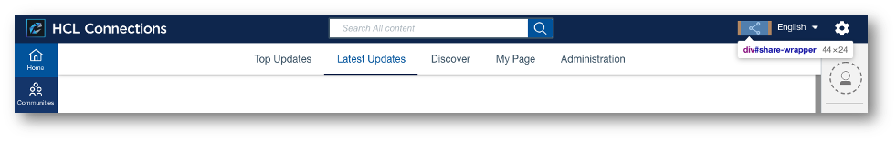
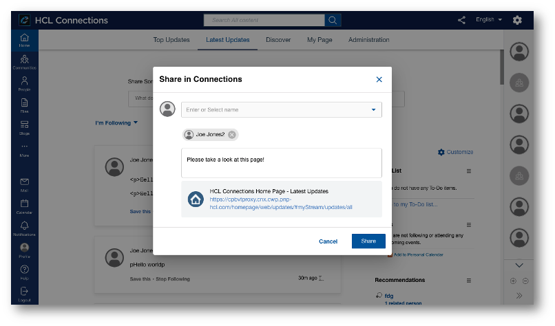
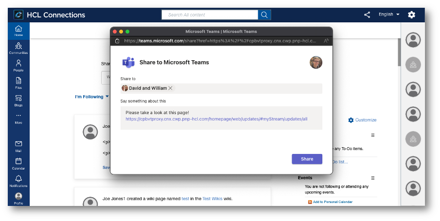

# Share Action

The share action is placed in the header area (specifically the actions area within the header) and provides a way to share the currently visible page with other users within Connections or external applications.




## Custom Styles
The share action doesn’t leverage specific custom styles. The dialog inherits styles from the [Modal](../modals) component.


## Custom Configuration

The share action custom config allows to add different sharing options and behaviors, most commonly to introduce sharing into third party applications like Microsoft Teams. The below example outlines the specific configuration requires to add Microsoft Teams as a sharing option, but is generally applicable for other such sharing options as well. 

### Extension Type

The custom styles use the extension type `com.hcl.share.extension`.

### Example

The following JSON snippet can be used to add Microsoft Teams as a share option:

```
{
    "name": "MS Teams Share Extension",
    "title": "MS Teams Share",
    "description": "Share extension to share link of current page into a Teams channel",
    "services": [
        "Connections"
    ],
    "state": "enabled",
    "extensions": [
        {
            "name": "MS Teams Share",
            "type": "com.hcl.share.extension",
            "payload": {
                "title": "Share in Teams",
                "include-files": [
                    "/files/customizer/share-extensions/ms-teams/connections-teams-share-extension-8.0.js"
                ],
                "cache-headers": {
                    "cache-control": "max-age=43200"
                },
                "className": "teams-share-button",
                "icon": {
                    "type": "svg",
                    "data": "data:image/svg+xml;base64,PHN2Zy ... 3N2Zz4="
                }
            },
            "path": "global",
            "state": "enabled"
        }
    ]
}
```

### Properties

The most important properties are `name`, `icon`, `type` and `include-files` in the `extension` and `payload` object in the above example. 

The name and the icon will be used as the name for this option in a dropdown component displaying all options. The dropdown appears if there is at least one share extension defined, and contains all available and enabled share extensions. Share extensions are recognized by their `type` value of `com.hcl.share.extension`.


The `include-files` property is used to define an additional JavaScript resource which is added to the DOM to execute a specific function.
The JavaScript resource is expected to contain the function `openShareExtension` which should contain the logic to open the dialog to the appropriate system.
This file can be added via e.g. customizer, but generally just needs to be a static resource that is available to all users. The JavaScript file in above example is available in the [Share Resources](./resources). It will lead to the following dialog being displayed in a new tab:


