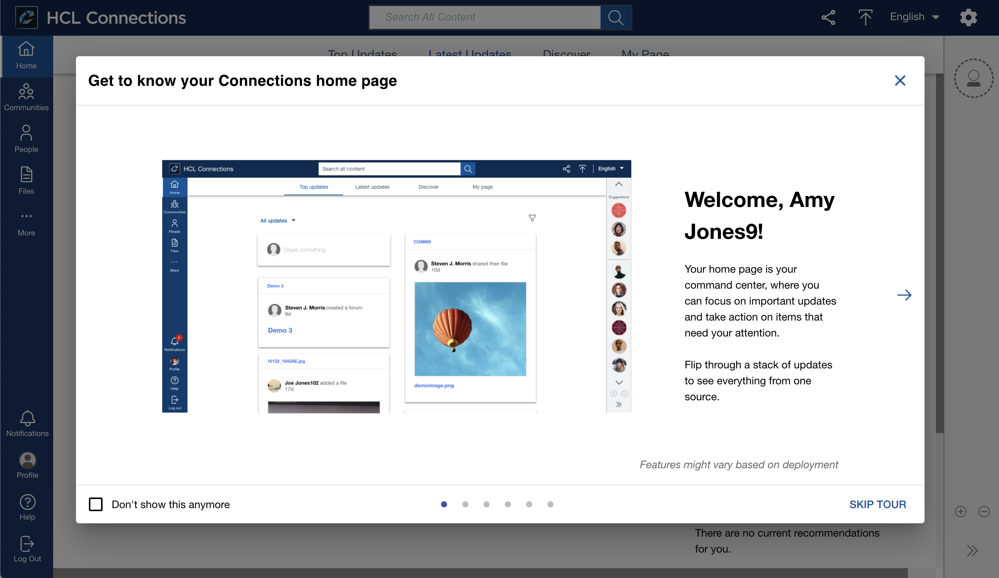

# Welcome Tour

The welcome tour can be used to provide an overview of the Connections 8 UI and features to users visiting Connections for the first time in general or since the update to the new version.

Users can decide to skip the tour, which leads to the tour reappearing at a later point (based on configuration). They can also check the *Dont' show this anymore* option to skip the tour without reappearing.



## Custom Styles
The welcome tour doesn’t leverage specific custom styles. The dialog inherits styles from the [Modal](../modals) component.


## Custom Configuration

The welcome tour custom config can be used to enable/disable the tour and define behavior around when it should appear for users. 

### Extension Type

The custom styles use the extension type `com.hcl.connections.tours`.

### Example

The following JSON snippet can be used to adjust the welcome tour behavior:

```
{
    "name": "Connections Tours Config",
    "title": "Connections Tours Config",
    "description": "Connections Tours Config - Description",
    "services": [
        "Connections"
    ],
    "state": "enabled",
    "extensions": [
        {
            "name": "connections-tours-config",
            "type": "com.hcl.connections.tours",
            "payload": {
                "disabled": false,
                "cacheExpiration": 86400000,
                "skipCacheExpiration": 86400000
            },
            "path": "global",
            "state": "enabled"
        }
    ]
}
```

### Properties

The property `disabled` controls whether the tour should be loaded on the page and should open up for users.

The `cacheExpiration` value steers how long the configuration should be stored on the client side, in ms.

The `skipCacheExpiration` value steers how long it takes before the tour shows again for a user that has skipped the tour via the `Skip Tour` button, in ms.
