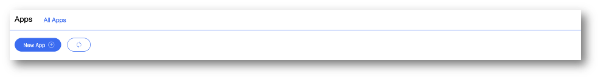
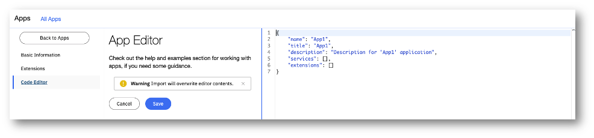
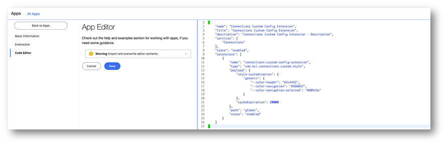
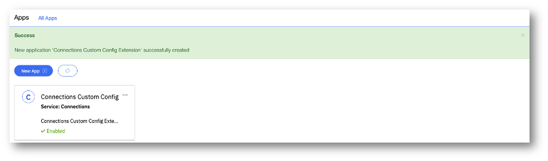
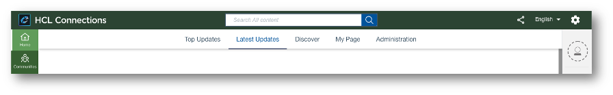

# Custom Config Extensions

Custom config extensions allow customization or theming of the Connections UI and components in a declarative manner. The Connections 8 UI and corresponding components are prepared for a variety of customization options and display according to the provided configuration.

The customizations can be provided through extension points that are processed via the Connections UI components and enrich the baseline configuration. The preferred way of defining such extensions is through the Connections app registry. This approach allows the most flexibility and provides some enhanced features like translation capabilities. As the app registry requires the Connections Component Pack, there are altenative extension points that will be outlined in this documentation as well.

Currently, the following components leverage extensible configuration to allow for customization:

- ### [Header Area](../main-areas/header-area/README.md#custom-config-extension)
  - The header area allows repositioning of the logo, the search bar and actions contained within. It also allows custom logos or additional text to be displayed.
- ### [Side Navigation](../main-areas/side-navigation/README.md#custom-config-extension)
  - The side navigation component allows adjustments of the menu entries to be displayed
- ### [Banner](../main-areas/banner/README.md#custom-config-extension)
  - The banner component is an optional component that can be enabled/disabled. It allows to define a custom message and a message type to be displayed to all users.
- ### [Custom Styles](../custom-styles/README.md#custom-config-extension)
  - The custom styles component injects CSS properties into the UI which other components adhere to. This allows exposing custom colors or sizes for different elements in a generic fashion.

**Note:** - The custom config extensions do not replace already existing customization options but instead provide a different angle of applying them. Due to the nature of implementation for some components, already existing customizations may not be supported anymore in the new Connections 8 UI (e.g. custom menu options in the Connections header). 

You can find a list of areas to be aware of or to consider migrating in the section [Impact on Legacy Customizations](../impact-on-legacy-customizations).

## Creating Config Extensions

### App Registry 

To create a custom config extension, log in to your HCL Connections environment as an administrative user and navigate the the URL `https://__CONNECTIONS_DOMAIN__/appreg/apps`.



Click on the `New App +` button and navigate to the `Code Editor`. 



Copy the below template of an App Registry app and paste it into the App Editor:

```
{
    "name": "Connections Custom Config Extension",
    "title": "Connections Custom Config Extension",
    "description": "Connections Custom Config Extension - Description",
    "services": [
        "Connections"
    ],
    "state": "enabled",
    "extensions": [
        {
            "name": "connections-custom-config-extension",
            "type": "com.hcl.connections.custom.style",
            "payload": {
                "style-customization": {
                    "generic": {
                        "--color-header": "#2c4433",
                        "--color-navigation": "#366032",
                        "--color-navigation-selected": "#609c5a"
                    }
                },
                "cacheExpiration": 20000
            },
            "path": "global",
            "state": "enabled"
        }
    ]
}
```

Click on `Save` to persist your changes.





Refresh your Connections UI to see the changes reflected. In this example, the [Custom Styles](../custom-styles/) extension was leveraged to change Connection to a green color theme. 



#### Explanation of Object Properties

The most important properties in the app configuration are the `type` and `payload` properties within the `extensions` array. 

The `type` specifies what component the extension relates to. Currently the following types are defined:

| Extension Type                      | Description                           | 
|-------------------------------------|---------------------------------------|
| com.hcl.connections.nav             | Customization of the [Side Navigation](../main-areas/side-navigation/) menu entries |
| com.hcl.connections.custom.style    | Customization of the [Header Area](../main-areas/header-area/) elements and general themeing via [Custom Styles](../custom-styles/).
| com.hcl.connections.banner          | Configuration of the [Banner](../main-areas/banner/) component and its content |
| com.hcl.search.customization        | Customization of the [Search Box](../main-areas/search-box/) component and the connected search application |
| com.hcl.share.extension             | Extension of the Connections [Share Action](../components/share-action/) share targets |
| com.ibm.itm.entry.person.default    | Customization of the [ITM Bar](../main-areas/itm-bar/) |
| com.hcl.appreg.ext.templatedLink    | Extension of the [Business Card](../main-areas/business-card) communication options |
| com.hcl.connections.tours | Extension of the Connections [Welcome Tour](../components/welcome-tour/) |

The `payload` object is specific to the individual component and the mandatory and optional properties it supports. See the above links for the respective extension to get more information around the expected payload.

In addition to the above options, the extension also expects name and title properties that provide context within the AppReg overview page or are used to render labels within the UI (e.g. the `name` property within the `com.hcl.share.extension` extension).

### Window Scoped JavaScript Objects

Besides App Registry extensions, many of the above extension types also support the definition of the payload through window scoped JavaScript objects. This approach primarily exists for environments that have not deployed the HCL Connections Component Pack.

For this approach, all supporting extensions expect a property `window.connectionsExtension` that contains the defined `type` from above list as a key within the object. For example, the above App Registry based config extension could be added via JavaScript as outlined below:

``` 
window.connectionsExtension = {
  "com.hcl.connections.custom.style": {
    "style-customization": {
      "generic": {
        "--color-header": "#2c4433",
        "--color-navigation": "#366032",
        "--color-navigation-selected": "#609c5a"
      },
    }
  },
  "com.hcl.connections.banner": {
    ...
  }
}
```

This means that this property needs to be injected into the HCL Connections pages prior to the extensions becoming available. A common approach for this would be to add the JavaScript (inline or referencing a static resource) via the existing JSP customization approaches (see [Impact on Legacy Customizations](../impact-on-legacy-customizations/)).

As in the above code example, this object is expected to contain all config extensions that should be available. 

The JavaScript object can also serve as a baseline but can be oversteered through existing App Registry extensions. For this, you can leverage the property `preferAppReg: true`.