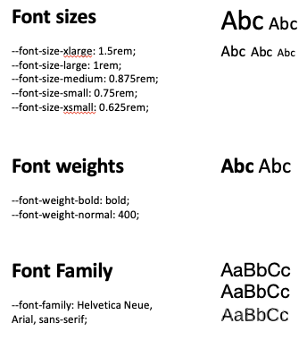

# Font Styles

The below font sizes, weights and families are the primary ones used within Connections. For components where those font styles are not sufficient, refer to our [HCL Design System – Typography](internal-link-redacted).



```
// Font sizes
--font-size-xlarge      : 1.5rem;
--font-size-large       : 1rem;
--font-size-medium      : 0.875rem;
--font-size-small       : 0.75rem;
--font-size-xsmall      : 0.625rem;
--font-size-header      : 1rem;

// Font weights
--font-weight-bold      : bold; 
--font-weight-normal    : 400;

// Font Family
--font-family           : Helvetica Neue, Arial, sans-serif; 
```
