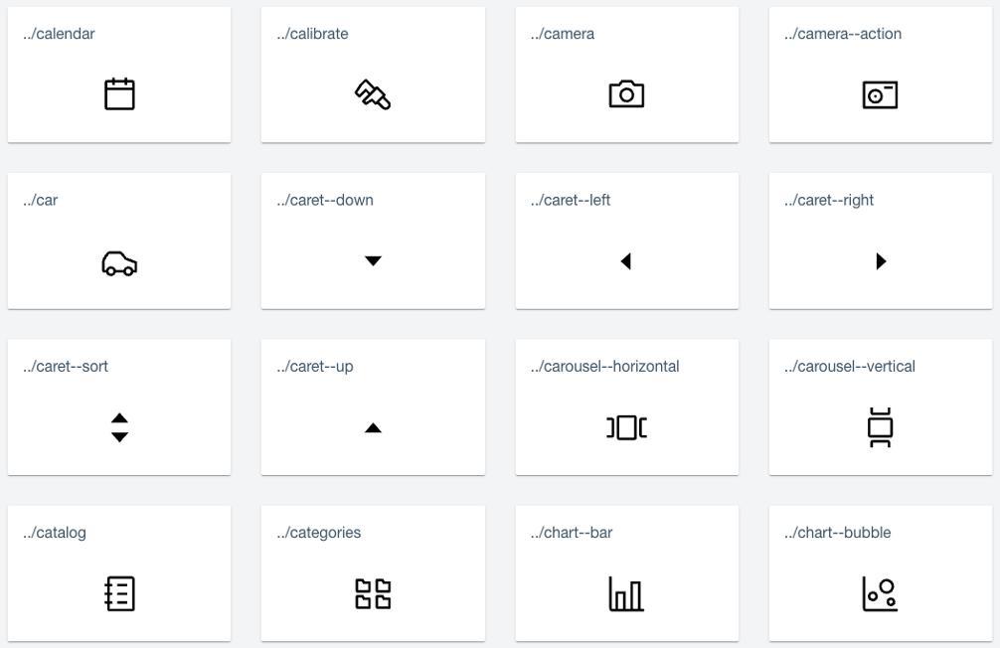

# Icons

Our icon set is based on the [Material Design](https://material.io/design) system and provides a large variety of icons for different areas and in different sizes. See [HCL Design System – Icons](internal-link-redacted) for all available icons. All icons are defined as SVGs. Preferably, use the icons provides through the Enchanted Material UI react libraries, or add them via the CSS background-image property.

