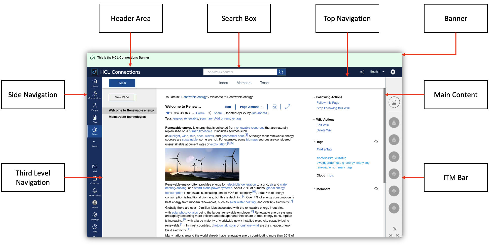

## Main Areas - Overview

The UI consists of the following common components or areas:

Follow the below links for more information about specific components/areas:
- [Header Area](./header-area)
- [Search Box](./search-box)
- [Side Navigation](./side-navigation)
- [Top Navigation](./top-navigation)
- [Third Level Navigation](./third-level-navigation)
- [Main Content](./main-content)
- [ITM Bar](./itm-bar)
- [Banner](./banner)