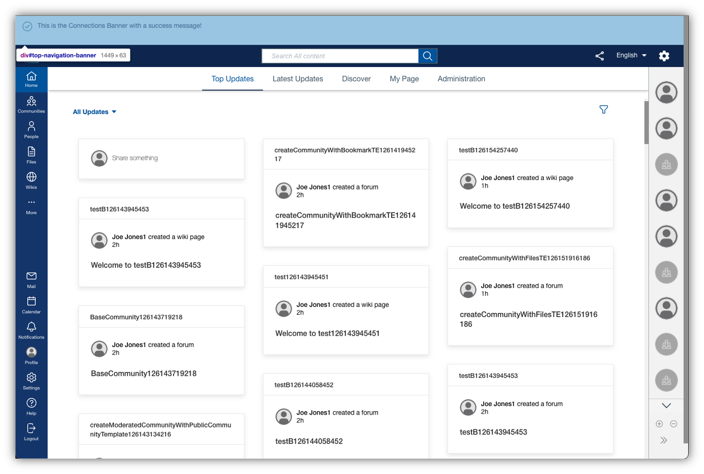

# Banner

The banner is an optional component to show an administrative message at the top of every Connections page and can be used to provide information such as scheduled updates, planned outages or company news to all users.



## Custom Styles
See the section [Custom Styles - Banner](../../custom-styles/README.md#banner).

## Custom Configuration - App Registry

The app registry based configuration is the preferred option as many of its features - like app/user scoping or translation - enrich the functionality of this component.

### Extension Type

The custom styles use the extension type `com.hcl.connections.banner`.

### Example

The following JSON snippet contains properties that can be used to alter the makeup of the banner area:

```
{
    "open": true,
    "message": [
        "This is the <strong>HCL Connections Banner</strong>"
    ],
    "severity": "info",
    "cacheExpiration": 0
}
```

### Properties

The following properties are available to be used within the banner component in order to change the visible content and makeup. All values are set to the defaults mention in above example, if they are not added via the component props.

### open

Defines whether this component should be displayed or not. If a message is defined by the Connections administrators, open needs to be set to true, otherwise false.

### message

Defines a comma seperated array of React text components, which will be concatenated to show to the user. This allows simple text messages like
```
['This is my message.']
```

but also more complex one that contain text formatting, e.g.
```
['A message with ', '<strong>bold</strong>', ' and ', '<i>italic</i>', ' text']
```

The individual parts of the message (or multiple messages) can be structurerd as parts in array like outlined above, but can also be provided in a single part in the form of an HTML template string like
```
['A message with <strong>bold</strong> text and <i>italic</i> text and a <a href="company.com">link</a>.']
```

This component internally evaluates given HTML and transforms it into the corresponding elements. **Note** while this method is implemented to be XSS safe and prevents script execution, this is only intended for simple HTML. While complex HTML should work, use at your own discretion.

### severity

Defines the type of message that should be displayed. Possible options are:
- `info`: Info icon, violet background
- `success`: Check icon, green background
- `warning`: Attention/warning icon, yellow background
- `error`: Exlamation icon, red background

## Custom Configuration - Foundation Features / HCXT

To allow dynamic reconfiguration of the banner, specifically in environment without an available Component Pack installation, the following API was introduced into the Connections Foundation Features (HCXT). 

The API provides a subset of the features available to the app registry approach outlined above but allows a configuration on the fly without requiring to restart the application - as would be the case with the general alternative approach, see [Custom Config Extensions - Window Scoped JavaScript Object](../../custom-config-extensions/README.md#window-scoped-javascript-objects).

This API can be leveraged by ICXT administrative users. 

### Creating/Updating the Banner

Send an HTTP `PUT` request to `<connections_hostname>/ic360/ui/api/admin-banner/config.json` with the below header and request payload:
```
# Header: 
Content-Type: application/json

# Request body:
{
    "open": true,
    "message": ["my ", "<b>new</b>", " banner message"],
    "severity": "success"
}
```
	
### Enabling or Disabling the Banner

To enable or disable the banner, send an HTTP `PUT` request to `<connections_hostname>/ic360/ui/api/admin-banner/enable` or `<connections_hostname>/ic360/ui/api/admin-banner/disable`, respectively.

### Checking an Existing Banner config

To check whether the banner is currently enabled/disabled and which properties it is configured with, send an HTTP `GET` request to `<connections_hostname>/ic360/ui/api/admin-banner/config.json` and evaluate the response payload. This endpoint returns a JSON object similar to the one noted in the request body example above.