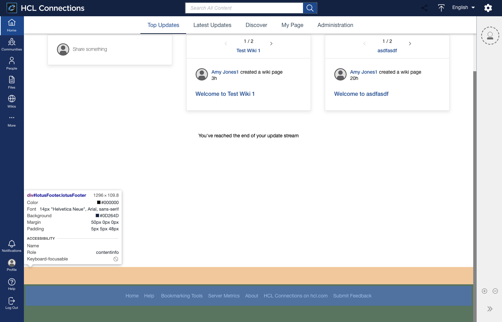

# Footer

The footer area contains links to common resources or help / usage details. 

## Custom Styles
See the section [Custom Styles - Footer](../../custom-styles/README.md#footer).

## Customization
See the article [Customizing the footer](https://help.hcltechsw.com/connections/v7/admin/customize/t_admin_common_add_footer_link.html) in the HCL Connections Documentation.