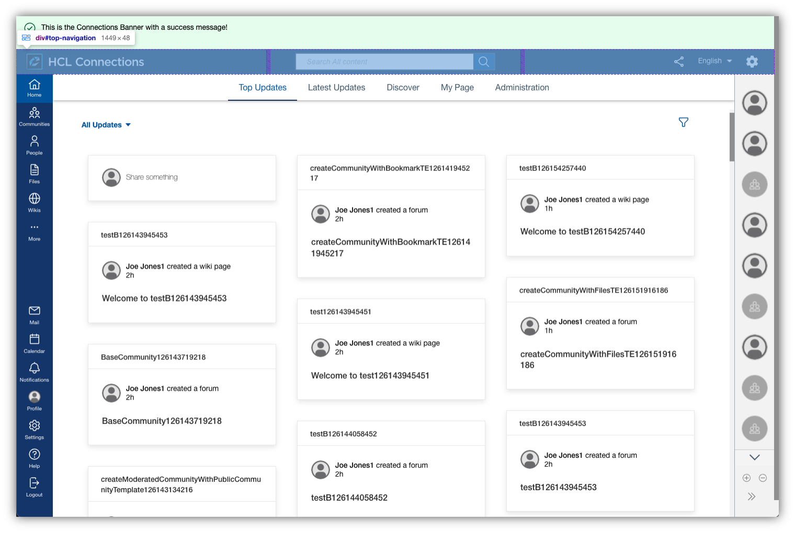
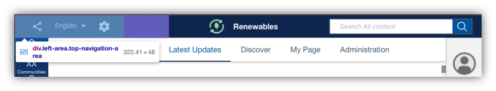
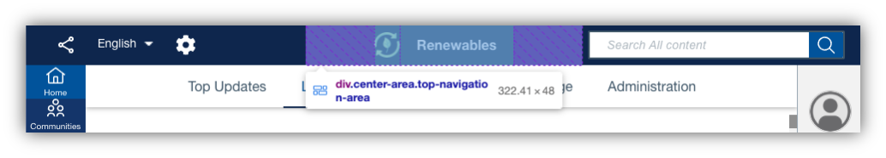
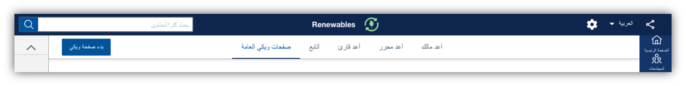
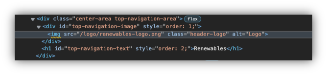

# Header Area

The header area consists of a left, center and right aligned area. The header currently contains the logo, the search box and an actions section (with the share action, language selector and a theme switcher for development).

The elements on the navigation bar can be repositioned via the Connections custom styles extension. This also allows to add an arbitrary text string and a custom logo. See [Custom Config Extensions](#custom-config-extension) for details.



## Custom Styles
See the section [Custom Styles - Header Area](../../custom-styles/README.md#header-area).

## Custom Configuration

The header custom configuration is part of the overall [Custom Styles](../custom-styles/README.md) extension. The header area component expects the property `top-navigation` within `style-customization` to be defined with information about the different elements that are contained within it. 

### Example

The following JSON snippet contains properties that can be used to alter the makeup of the header area:

```
{
    "style-customization": {
        "generic": {
            ...
        },
        "top-navigation": {
            "actions": {
                "position": "left"
            },
            "search": {
                "position": "right"
            },
            "logo": {
                "position": "center",
                "order": "1",
                "src": "/logos/renewables-logo.png"
            },
            "text": {
                "position": "center",
                "order": "2",
                "content": "Renewables"
            }
        }
    }
}
```

### Properties

The `top-navigation` object expects a config definition for any of the values `logo`, `search`, `text` or `actions`.  They relate to the logo, the search bar and the action icons displayed in the top navigation bar, as well as an optional text to be displayed in the top navigation as well. The properties can be defined independently of one another.

#### Positioning of Elements

Each of these values expects a property `position` and `order`, which define where in the top navigation they should be displayed. The allowed values for position are `left`, `center` and `right`, relating to a left, center or right alignment of the element within the top navigation. 

See for example the `actions` menu which has been moved to the left in the above example:



The alignments are implemented through area containers that the objects reside in. If there is more than one element within a given area, the order property can be used to define in which order the elements should be displayed in the area. By default, each element has the same order of 5 leading to a first added, first positioning from the left. A smaller order leads to the element preceding another element, and vice versa.

See the properties `logo` and `text` from above example, which both share a center position but use the `order` property to indicate the `logo` should be to the left of the `text`:



**Note** 
Under the hood, the positioning is done via CSS flexbox with three areas (left, center and right) and ordering of elements. This natively applies right to left rearrangement of elements for RTL based languages like Arabic:



#### Additional Text in the Header

The text in the above screenshot is added through the optional property `text`, which expects an additional value `content`. The content relates to the actual text to be displayed for this field. As soon as a text with content is defined, it will be added to the top navigation - by default to the left content area.

 The image can be further optimized with regard to rendering size via [custom style properties for header text](../../custom-styles/README.md#header-area).

#### Defining a Custom Logo

Arguably the biggest requirement for customization options of the header area is the replacement of the **HCL Connections** logo with the one of your company. To do so, the `image` property expects a `src` tag which replaces the actual image src tag. So any image that is accessible to the clients as a static resource and is in a supported file type (.jpeg, .png, .svg, etc.) can be referenced and used.



 The image can be further optimized with regard to rendering size via [custom style properties for the header logo](../../custom-styles/README.md#header-area).