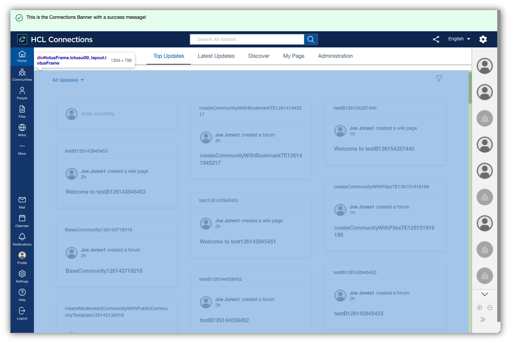

# Main Content

The main content area contains the application specific content.

## Custom Styles
There are no custom styles for the main content as a whole, but styles for specific components (links, buttons, chips). See the section [Components](../../components/) for more details.