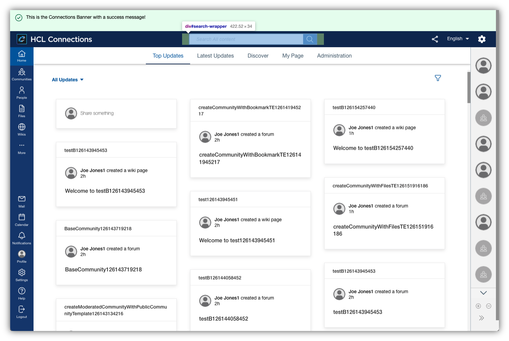
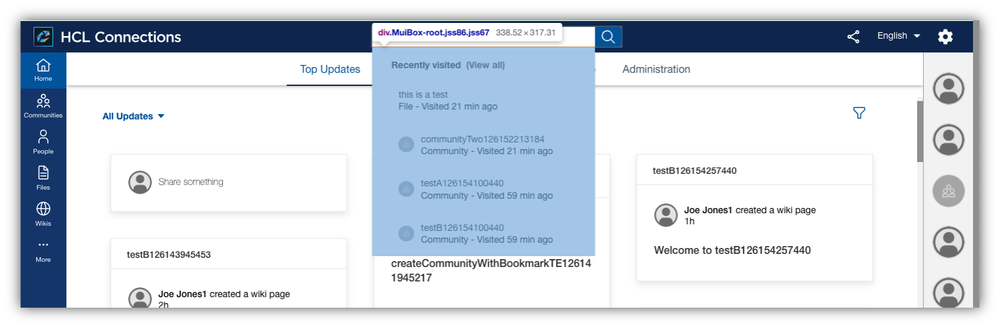
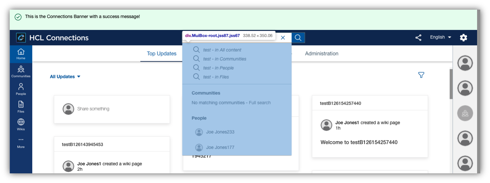

# Search Box

The search box is placed in the header area and provides recently visited (CP only) or quick results via typeahead. On search it will open the Connections Search full page view. The search box reacts contextually with different filter options, recently visited content or recommended entities depending on the interaction and current application view.





## Custom Styles
There are no custom styles for the main content as a whole, but styles for specific components (links, buttons, chips). See the section [Components](../../components/) for more details.

## Custom Configuration

The search box can be customized via the Connections navigation extension, in particular the search options can be reconfigured in order to adjust the search endpoints and behavior.
The App Registry also allows for translations for menu entries to be provided in the same declarative manner as other values.

### Extension Type

The custom styles use the extension type `com.hcl.search.customization`.

### Example

The following JSON snippet contains properties that can be used to alter the makeup and options of the search box:

```
{
    "searchResultOptions": [
        {
            "searchURL": "http://www.google.com/search?q=${searchTerm}",
            "options": [
                {
                    "label": "Google",
                    "url": "http://www.google.com/search?q=${searchTerm}"
                },
                {
                    "label": "Connection",
                    "url": "<your-connections-host>/homepage/web/updates/#topUpdates/topUpdates/all&qs=${searchTerm}&scope=allconnections&ntf=false&p=1&ps=10&soc=%7B%7D&sk=relevance&pers=false&ppl=&t=&dr=&do=all"
                },
                {
                    "label": "Sharepoint",
                    "url": "<your-sharepoint-site>/search.aspx/siteall?q=${searchTerm}"
                }
            ]
        }
    ]
}
```

### Properties

#### searchURL
The search url property defines what search website to open when clicking on the search button / hitting enter. 

#### options 
The options should provide an array of search endpoints that the user can select from when typing a search query. The option will be displayed as a list below the search box. Each search option should be provided as a JSON object with the following properties:

- label - The name of the search endpoint to be presented to the user
- url - the url that should be opened when clicking the option

**Note** the placeholder `${searchTerm}` in the above sample URLs will be replaced by the search query defined by the user and thus should be the query parameter used in the search endpoint to be configured.