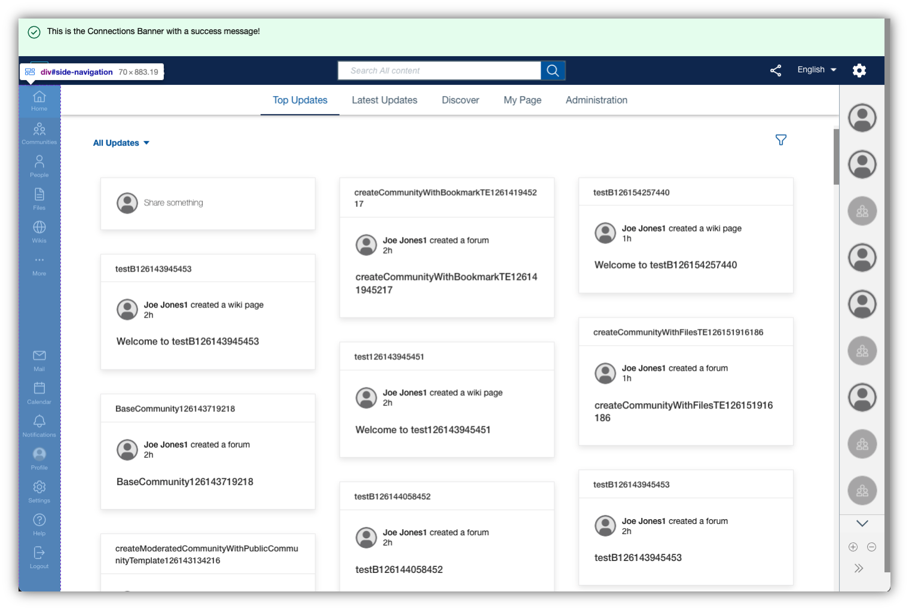

# Side Navigation

The side navigation contains menus specific to the available Connections apps and important user links, separated into a main and bottom area (as well as sub menus). 




## Custom Styles
See the section [Custom Styles - Side Navigation](../../custom-styles/README.md#side-navigation).

## Custom Configuration

The navigation can be customized via the Connections navigation extension – i.e. menus can be change or removed, and custom menu entries or sub menus can be added.
The App Registry also allows for translations for menu entries to be provided in the same declarative manner as other values.

### Example

The following JSON snippet contains properties that can be used to alter the makeup of the menu entries within the side navigation:

```
{
    "customEntries": [
        {
            "id": "intranet",
            "name": "Intranet",
            "action": "add",
            "link": "https://customer.com/",
            "icon": "https://customer.com/images/logo.png",
            "order": 7000,
            "new_window": true,
            "submenu": [],
            "location": "main"
        },
        {
            "id": "homepage",
            "name": "My Home",
            "action": "update"
        }
    ]
}
```

### Properties

The `customEntries` array expects a list of actions to be processed against the default navigation entries. A snapshot of the default entries can be found in the appended [Resources](./resources/).

The `action` attribute within an entry defines what type of change should be applied to the navigation. The following actions are available to use:
- `add` - adds a new entry to the navigation. This option requires the additional properties `id`, `link`, `icon` and `location`.
- `remove` - removes an existing entry from the navigation. This option requires the additional property `id`.
- `update` - updates an existing entry with the provided properties

To update or remove an entry, the `id` attribute is used to match the given action with the existing entry. For add actions, make sure to define a unique arbitrary id. The id is also used as a default label in case no other `name` has been provided, and no translation exists in the system. 

The `name` entry defines the label to display for the respective entry. **Note:** For translations you can use the generic translation approach available through the App Registry.

The `location` and `order` properties are used to define in which position within the navigation the respective entry should be displayed. The location allows the properties `main` and `bottom` for the respective area, while the order property is used to sort the entries within the area from lowest to highest, top to bottom.

The `link` property is used for the navigation target the entry should forward to. The `icon` property allows to provide an image source, which can be either a link to a static image or inline image, e.g. an encoded svg data object.

The `submenu` property is used for adding an additional menu with more options. The configuration expects the entries within the submenu to be provided as a list. See the `more` element in the default entries as an example. `submenu`s are only recognized and applied in the `main` area.

### Roles

Entries can optionally define properties which validate the role of the user and determine if the navigation entry should be displayed for the user. The role values are Connections application defined user roles for the `Common` application. As a Connections WebSphere administrator, you can access the roles list for the Common application by launching the WebSphere administration console and navigating to the list of installed Enterprise Applications. Select the application named Common and then view _Security role to user/group mapping_.

Roles property names

- `forbiddenRoles` - Only display the navigation entry if the user does not contain any of the supplied roles. This property is commonly used with the value of `external`, which would only show the menu entry for internal users.
- `requiredRoles` -  Only display the navigation entry if the user contains all of the supplied roles. For example, a required role of `global-moderator` is used to display the Moderation entry on systems where the Moderation application is enabled.

Special role values

The following property values do not reflect true application security roles, but can be used for the purpose described below.

- `external` - the user is an external user of the system (not an internal employee)
- `internal` - the user is an internal employee
- `authenticated` - the user has been authenticated.
- `anonymous` - no user has been authenticated


### Roles Example

Extending the above example to require that the intranet application entry is only displayed for internal users.

```
{
    "customEntries": [
        {
            "id": "intranet",
            "name": "Intranet",
            "action": "add",
            "link": "https://customer.com/",
            "icon": "https://customer.com/images/logo.png",
            "order": 7000,
            "new_window": true,
            "submenu": [],
            "location": "main",
            "requiredRoles": "internal"
        }
    ]
}
```
