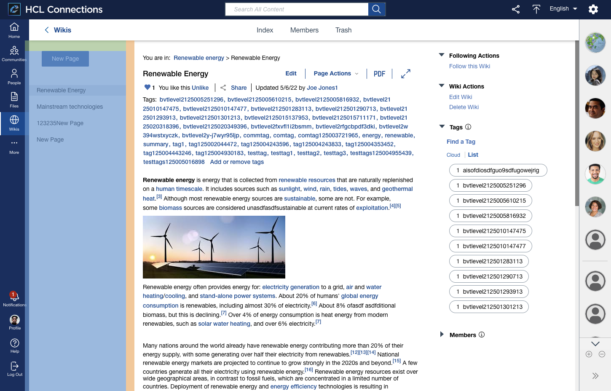

# Third Level Navigation

The third level navigation contains menus specific to the view you are currently on. This could be Wiki pages in a Wiki or sub menus in the Files application.

## Custom Styles
See the section [Custom Styles - Third Level Navigation](../../custom-styles/README.md#third-level-navigation).